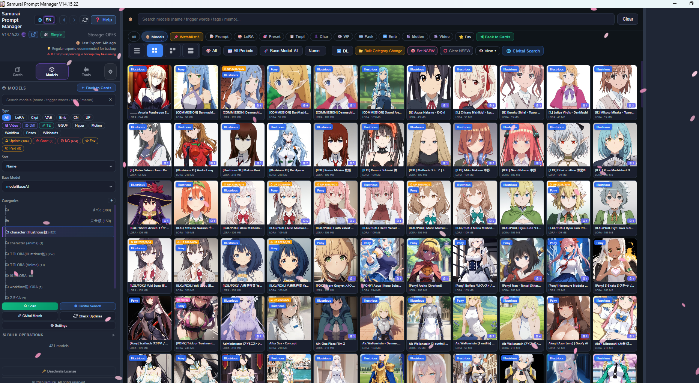
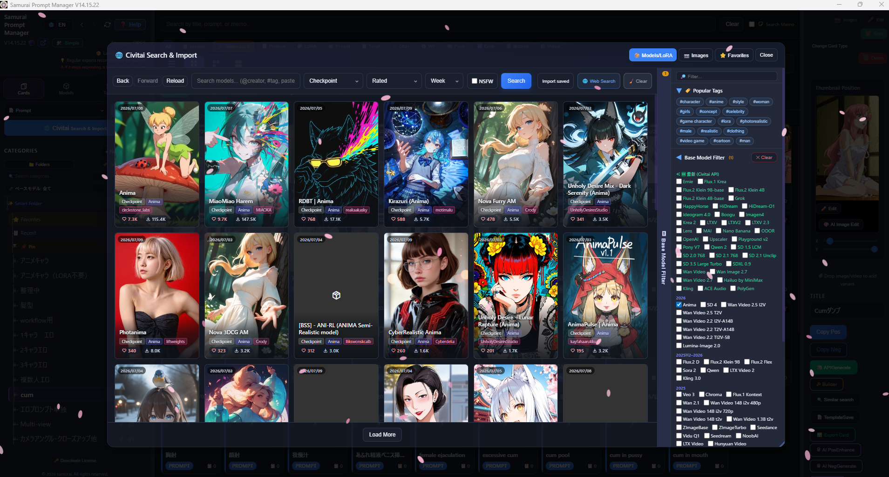
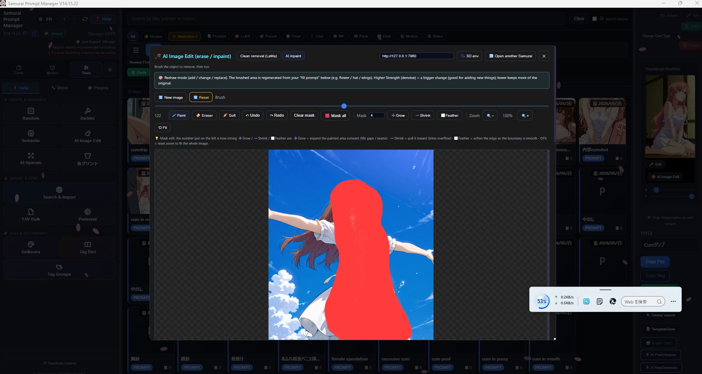

# 🗡️ Samurai Prompt Manager

**A prompt & "SD Card" manager for Stable Diffusion — keep your prompts, models, LoRAs and generated images organized in one desktop app.**

Works with **A1111 · Forge · SwarmUI · ComfyUI**

[-f59e0b)](https://samuraiya.booth.pm/items/8059288)

**English** ｜ [日本語](./README.ja.md)

[▶ Watch the 4-min demo](https://youtu.be/lQMfM4adCrY) · [⬇ Download on Booth](https://samuraiya.booth.pm/items/8059288) · [📖 Review article](https://civitai.red/articles/30481)

<!--
  HERO IMAGE — replace with a wide screenshot of the card grid or model view.
  Put the file at images/hero.png (create the images/ folder in the repo).
-->

  

---

## ✨ What it does

Samurai Prompt Manager is a **local-first desktop app** (Electron) that turns the mess of prompt text files, model folders, and screenshot dumps into a searchable, visual library. Everything stays **on your machine** (IndexedDB / OPFS) — no cloud account required.

- 🗂️ **Card library** — organize your work as typed cards: **Prompt · LoRA · Character · SD Preset · Template · Workflow · Embedding · FramePack · Video**. Categories, favorites, pins, smart folders, and bulk type conversion.
- 🖼️ **Automatic metadata extraction** — drop in a PNG / JPEG / WebP (or video) and it reads the generation data. Understands **A1111 / Forge, SwarmUI, ComfyUI workflows, InvokeAI, NovelAI, and Fooocus** formats.
- 🛰️ **Civitai integration** — scan your local model folders and **match them to Civitai** to auto-fill triggers, base model, preview images and version info. Base-model filtering, non-commercial (NC) filtering, update detection, and one-click **bulk "full reset & re-fetch"**.
- 🎛️ **Use your existing models & LoRAs** — point it at what you already have (a quick scan is required). **No limit** on the number of models.
- 🎨 **AI image editing** — built-in **inpaint / outpaint** against A1111 / Forge (ComfyUI backend is experimental). Auto Tag from any image (**WD14 offline** or AI Vision), ControlNet pose lock, LoRA insertion, and tag chips with inline translation.
- 🤖 **AI assist** — tag generation & gap-filling, prompt analysis, and prompt translation via **Gemini / DeepL / Ollama / MyMemory**.
- 🔎 **Semantic search** — find cards by meaning, not just keywords (embedding-based).
- 🏷️ **Tag dictionary & groups** — reusable user tags, grouping, and favorites.
- 💾 **Robust backup** — export/restore your whole library, with large (multi-GB) image libraries split automatically so big backups actually save and restore.
- 🌐 **Multi-language UI** — Japanese / English + 5 more, with a dynamic translation cache.

<!--
  SCREENSHOTS — drop 3 images into images/ and they'll render below.
  Suggested shots: 1) the card / model grid, 2) Civitai search & matching, 3) AI image edit / inpaint.
-->
## 📸 Screenshots

| Card & model library | Civitai search & matching | AI image edit (inpaint) |
|---|---|---|
|  |  |  |

---

## 🎥 Demo video (4 min)

Click to watch on YouTube:

---

## 💳 Pricing & license

| | Free | Full license |
|---|---|---|
| **Cards** | Up to **100** | **Unlimited** |
| **Models / LoRAs** | Unlimited | Unlimited |
| **Devices** | — | **2** |
| **Price** | Free | **$9.90** |

The free version stores up to **100 cards**; once you hit the limit, new cards can't be saved (you can still delete and reuse existing slots). The full license is needed once you want to manage more than 100 cards.

➡️ **[Get the free or full version on Booth](https://samuraiya.booth.pm/items/8059288)**

---

## ⬇️ Download & install

Prebuilt packages are distributed on **[Booth](https://samuraiya.booth.pm/items/8059288)**.

| OS | Format |
|---|---|
| **Windows 10 / 11** | Portable `.exe` (x64) |
| **macOS** | `.dmg` (Intel **and** Apple Silicon) |
| **Linux** | `AppImage` / `.deb` (x64) |

Download, run, and point the app at your model folders (a one-time scan). Your library and settings live locally on your device.

---

## 🔄 Update policy

- Updates are **free through the next major version (~v16)**.
- Purchasers may be featured on the project's page.
- Development may pause if interest is low — buying the license directly supports continued work.

The **SD-card workflow is stable and recommended today.** ComfyUI integration is actively being refined.

---

## 📖 Related article

A detailed review & walkthrough is available on Civitai.red:

🔗 **<https://civitai.red/articles/30481>**

---

## ℹ️ Support & scope

This is an actively developed solo project. To set expectations up front:

- **No refunds**, and **individual support / inquiries aren't guaranteed.**
- **Collaboration requests aren't being accepted** at this time.
- Development is self-funded, so **purchases are genuinely appreciated** and keep it going. 🙏

---

Made for the Stable Diffusion community · [Booth](https://samuraiya.booth.pm/items/8059288) · [Demo](https://youtu.be/lQMfM4adCrY) · [Article](https://civitai.red/articles/30481)

